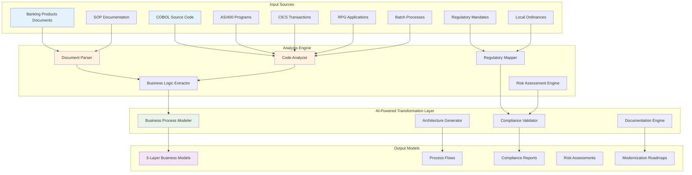
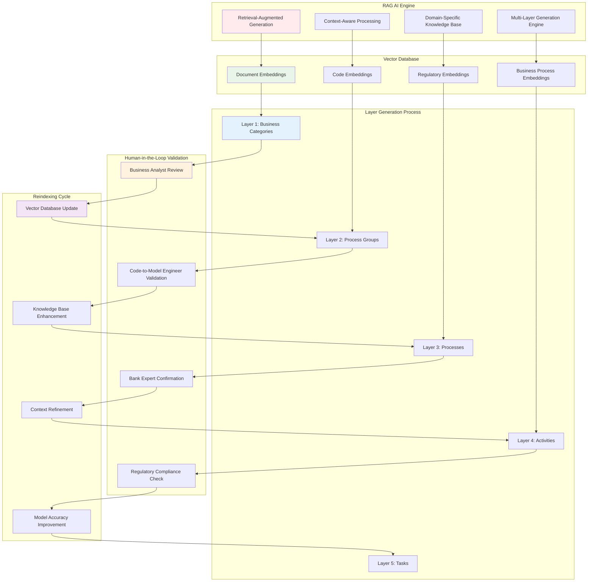
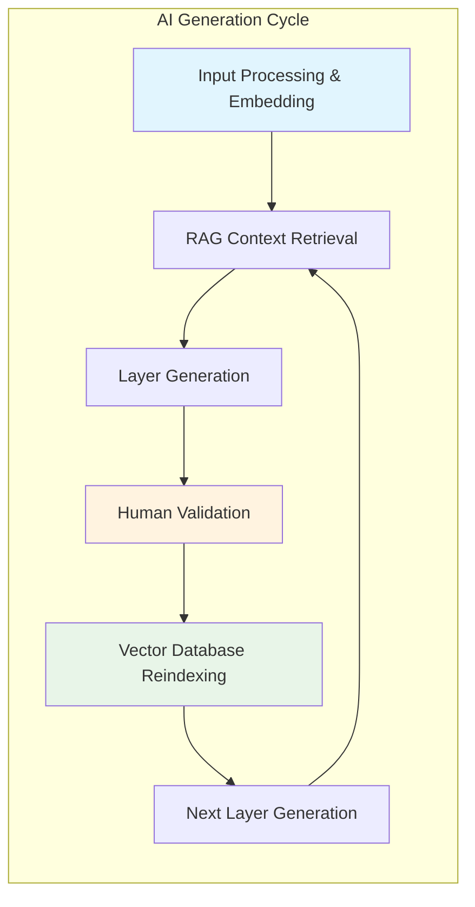
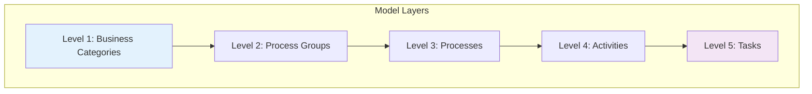

# Code-to-Model Architecture: Legacy System Transformation Platform

*Powered by Glue - AI-Driven Legacy System Modernization*

---

**CONFIDENTIAL - Glue Proprietary Information**  
*This document contains confidential and proprietary information of Glue. Unauthorized distribution is prohibited.*

## Executive Summary

The Code-to-Model platform represents a revolutionary approach to legacy system modernization, specifically designed for financial institutions operating on IBM mainframe environments. Our platform transforms COBOL, AS/400, RPG, and CICS systems into comprehensive business models that bridge the gap between legacy technical implementations and modern business requirements.

## Core Value Proposition

### Business Transformation Focus
- **Regulatory Compliance**: Automated mapping of legacy code to current banking regulations and HKMA requirements
- **Risk Mitigation**: Systematic identification of operational and compliance risks in legacy systems
- **Digital Transformation**: Enables strategic modernization decisions based on comprehensive system understanding
- **Knowledge Preservation**: Captures institutional knowledge embedded in legacy systems

### Technical Excellence
- **Multi-Platform Support**: COBOL, AS/400, RPG, CICS, and batch processing systems
- **Intelligent Analysis**: AI-powered code analysis with domain-specific banking expertise
- **Standards Compliance**: IBM documentation standards and BPMN 2.0 modeling
- **Scalable Architecture**: Enterprise-grade platform supporting large-scale transformations

## System Architecture Overview

## AI-Powered Architecture Components

## Core Components Architecture

### 1. Input Processing Layer

#### Document Intelligence Engine
- **Banking Products Analysis**: Extracts business rules, product specifications, and operational procedures
- **SOP Processing**: Converts standard operating procedures into structured business processes
- **Regulatory Framework Mapping**: Aligns local ordinances and regulatory mandates with system capabilities

#### Legacy Code Analyzer
- **Multi-Language Support**: COBOL, RPG, CICS, and batch processing analysis
- **Business Logic Extraction**: Identifies core business functions and decision points
- **Data Flow Mapping**: Tracks data transformations and business rules
- **Integration Point Detection**: Maps system interfaces and dependencies

### 2. AI-Powered Analysis & Transformation Engine

#### RAG AI Generation Process

#### Iterative Layer Generation with Human Validation
- **Layer-by-Layer Generation**: Each layer is generated sequentially using RAG AI
- **Human-in-the-Loop Validation**: Every layer requires human expert validation before proceeding
- **Vector Database Reindexing**: After each validation, the vector database is updated with new insights
- **Context Enhancement**: Each iteration improves the AI's understanding and generation accuracy
- **Quality Assurance**: Continuous improvement through feedback loops and expert validation

#### Compliance & Risk Engine
- **Regulatory Gap Analysis**: Identifies compliance requirements not addressed in legacy systems
- **Risk Assessment**: Evaluates operational, technical, and compliance risks
- **Control Mapping**: Maps existing controls to regulatory requirements
- **Mitigation Strategy Development**: Recommends risk mitigation approaches

### 3. Output Generation Layer

#### 5-Layer Model Generator

## Technology Stack

### Core Platform
- **Analysis Engine**: Advanced NLP and code parsing technologies
- **Modeling Framework**: BPMN 2.0 and UML standards compliance
- **Documentation Engine**: IBM standards-aligned documentation generation
- **Integration Layer**: RESTful APIs and enterprise integration capabilities

### Security & Compliance
- **Data Protection**: End-to-end encryption for sensitive banking information
- **Access Control**: Role-based access management with audit trails
- **Compliance Framework**: Built-in regulatory compliance validation
- **Audit Capabilities**: Comprehensive logging and audit trail generation

## Transformation Capabilities

### Legacy System Types Supported

#### COBOL & Copybooks
- **Data Structure Extraction**: Parse copybook definitions to extract data structures, field definitions, and record layouts
- **Paragraph Flow Analysis**: Map COBOL paragraph flows and program logic to business processes
- **File Reference Mapping**: Identify file references, database connections, and data access patterns
- **Business Logic Extraction**: Extract embedded business rules and validation logic from COBOL programs
- **Regulatory Checkpoint Mapping**: Map program logic to regulatory compliance checkpoints and controls

#### Batch Jobs (JCL / AS400 CL)
- **Job Stream Analysis**: Identify job streams, dependencies, and scheduling relationships
- **Critical Timing Discovery**: Capture critical cut-off times, SLA requirements, and time-sensitive operations
- **Operational Controls**: Extract recoverability procedures, rerun conditions, and error handling mechanisms
- **Resource Management**: Map resource requirements, file dependencies, and system resource utilization
- **Business Process Integration**: Link batch processes to end-to-end business workflows

#### CICS Transactions
- **Online Flow Discovery**: Map CICS transaction flows and user interaction patterns
- **MAPSET Analysis**: Parse BMS MAPSETs to understand screen layouts and user interface requirements
- **API/MQ Integration**: Identify external API calls, MQ message processing, and integration points
- **Real-time Activity Modeling**: Model real-time activities, response time requirements, and performance characteristics
- **Exception Handling**: Capture exception handling procedures, error recovery, and user notification mechanisms

#### RPG/AS400 Modules
- **Business Rule Extraction**: Parse business rules embedded in RPG logic and calculation routines
- **Process Integration**: Link RPG modules back to mid-office and back-office business processes
- **SOP Alignment**: Map RPG program logic to standard operating procedures and business workflows
- **Data Transformation Logic**: Extract data transformation rules and business calculation algorithms
- **Integration Point Discovery**: Identify external system interfaces and data exchange patterns

### Business Domain Expertise

#### Banking Operations
- **Payment Processing**: Payment workflows and validation rules
- **Card Management**: Credit and debit card processing systems
- **Account Management**: Customer account and portfolio management
- **Risk Management**: Credit risk and operational risk systems

#### Regulatory Compliance
- **HKMA Requirements**: Hong Kong Monetary Authority compliance mapping
- **Local Ordinances**: Regional regulatory requirement analysis
- **Industry Standards**: Banking industry best practices integration
- **Audit Requirements**: Internal and external audit preparation

## Implementation Methodology

### Phase 1: Assessment & Discovery
- **System Inventory**: Comprehensive legacy system cataloging
- **Documentation Review**: Analysis of existing documentation and procedures
- **Regulatory Mapping**: Current compliance status assessment
- **Risk Evaluation**: Initial risk assessment and gap analysis
- **Business Collaboration**: Intensive collaboration with bank experts to gather comprehensive business context
  - **Risk Team**: Regulatory requirements, compliance frameworks, and risk assessment criteria
  - **Product Team**: Product specifications, business rules, and customer requirements
  - **Business Architecture**: Enterprise architecture alignment and strategic objectives
  - **Business Analysts**: Current business processes, workflows, and operational procedures

### Phase 2: Analysis & Modeling
- **Code Analysis**: Deep technical analysis of legacy systems
- **Business Process Extraction**: Conversion of technical implementations to business processes
- **Compliance Validation**: Regulatory requirement mapping and validation
- **Model Generation**: Creation of comprehensive 5-layer business models
- **Collaborative Validation**: Each layer validated by cross-functional team before proceeding to next layer
  - **Business Analysis Team**: Validates business logic and process flows
  - **Code-to-Model Engineers**: Ensures technical accuracy and completeness
  - **Local Bank Experts**: Confirms business context and regulatory alignment
  - **Iterative Refinement**: Continuous improvement based on stakeholder feedback

### Phase 3: Validation & Optimization
- **Stakeholder Review**: Business and technical stakeholder validation
- **Model Refinement**: Iterative improvement of generated models
- **Compliance Verification**: Final regulatory compliance validation
- **Documentation Completion**: Comprehensive documentation package delivery
- **Code-to-Model Validation Engine**: Automated validation and gap analysis
  - **Line-by-Line Code Comparison**: Automated comparison between legacy code and generated model documentation
  - **Gap Identification**: Systematic identification of missing or incomplete documentation
  - **Quality Assurance**: Automated quality checks for completeness and accuracy
  - **Continuous Improvement**: Feedback loop for model enhancement and refinement

## Benefits & Outcomes

### Strategic Benefits
- **Risk Reduction**: 60-80% reduction in compliance and operational risks
- **Cost Optimization**: 40-60% reduction in legacy system maintenance costs
- **Knowledge Preservation**: 100% capture of embedded business knowledge
- **Modernization Readiness**: Clear roadmap for digital transformation initiatives

### Operational Benefits
- **Compliance Assurance**: Automated regulatory compliance validation
- **Process Optimization**: Identification of process improvement opportunities
- **Documentation Quality**: IBM standards-compliant documentation
- **Training Support**: Comprehensive training materials for new staff

### Technical Benefits
- **System Understanding**: Complete understanding of legacy system architecture
- **Integration Planning**: Clear integration requirements for modernization
- **Performance Optimization**: Identification of performance improvement opportunities
- **Maintenance Efficiency**: Streamlined maintenance and support processes

## Success Metrics

### Quantitative Metrics
- **Coverage**: 90%+ of legacy systems analyzed and documented (with collaboration of our Business Analysis and Bank's experts)
- **Accuracy**: 90%+ accuracy in business process extraction (with code comparison between legacy system and model documentation)
- **Compliance**: 80%+ regulatory requirement mapping (with external public information from Governoment Authority and internal document / communications from regulators to Risk and Compliance team)
- **Efficiency**: 80% reduction in documentation creation time (shorten exploration from months to days)

### Qualitative Metrics
- **Stakeholder Satisfaction**: High satisfaction scores from business and technical teams
- **Knowledge Transfer**: Successful knowledge transfer to new team members
- **Decision Support**: Improved decision-making for modernization initiatives
- **Risk Management**: Enhanced risk management and compliance capabilities
- **Auto Code Model Matching Engine**: A Engine to compare code line by line and to search within Model 5 layers of documentation to identify gaps. 

## Conclusion

The Code-to-Model platform represents a paradigm shift in legacy system modernization, providing financial institutions with the tools and insights needed to navigate the complex landscape of digital transformation while maintaining regulatory compliance and operational excellence. Our comprehensive approach ensures that valuable business knowledge embedded in legacy systems is preserved and leveraged for future success.

---

## Company Information

**Glue** - Transforming Legacy Systems into Modern Business Models

*Empowering financial institutions with AI-driven legacy system modernization and regulatory compliance solutions.*

---

## License & Disclaimer

**© 2025 Glue. All Rights Reserved.**

This document contains confidential and proprietary information of Glue. The information contained herein is provided for evaluation purposes only and may not be reproduced, distributed, or used for any commercial purpose without the express written consent of Glue.

### Confidentiality Notice
- This document is confidential and intended solely for authorized recipients
- Unauthorized copying, distribution, or use of this document is strictly prohibited
- All intellectual property rights remain the property of Glue

### Disclaimer
- The information provided is for general guidance only
- Glue makes no warranties regarding the accuracy or completeness of this information
- Implementation results may vary based on specific system configurations and requirements
- For detailed technical specifications and implementation guidance, please contact Glue's technical team

### Contact Information
**Glue AI**  
*Code to Model - Legacy System Modernization Specialists*  

---

*This architecture document provides a high-level overview of Glue's Code-to-Model platform capabilities. For detailed technical specifications and implementation guidance, please contact our technical team.*
